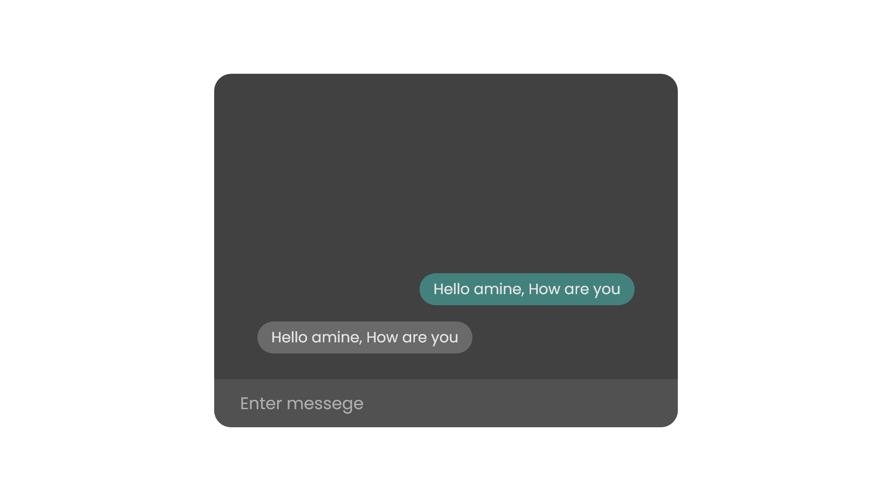

# **Auto chat with Javascript**

## **Introduction** : 
---------------------
Auto chat is a mo3awid of ai let user tfa3l with browser.
- Help user solve problem
- Ai speaking
- Replace feedback

## **Sould know** : 
----------
- HTML 5
- CSS 3
- Javascript

## **How it work** :
----------------
Site take a question (input) from user comapre it and answer (output).

```js
    if ( input == "" ) {

        output = "" ;    

    } else if ( input == "" ) {

        output = "" ;    

    } else if ( input == "" ) {

        output = "" ;    

    }
```


<br>
Print the input as a message like other social media
<br>
<br>

<br>
discussion forums, and to create rich text using a plain text editor.


to create rich text using a plain text editor.